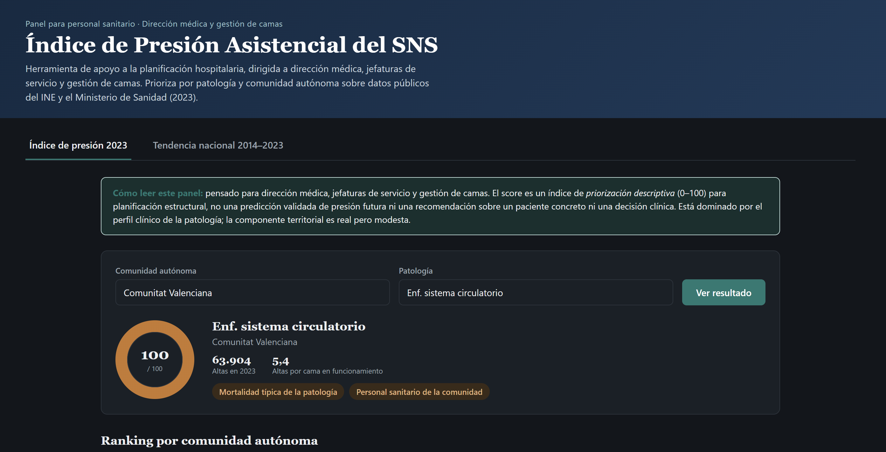

# Delivery 5 – Front-End Design and User Experience of the Product

> **Revision note (continuation towards the complete TFM):** this document extends the front end of the previous version (focused only on demand) to the three modules defined in Deliveries 3 and 4: demand forecasting (M1), transfer prioritisation index (M2) and readmission risk index at discharge (M3). The same design principle is maintained: the system is advisory, never prescriptive, and no result is presented without its margin of uncertainty or its explicit level of aggregation.

## 1. Summary of the Solution and the User

**Problem addressed by the project:** SNS hospitals manage three interrelated decisions in a predominantly reactive manner: how much demand will arrive, in which pathologies/areas it is advisable to reinforce transfer capacity, and in which discharge profiles the readmission risk is highest. The project converts the real historical series 2014–2023 (EMH, ESCRI, DRG, iCMBD) into three actionable indicators to support those three decisions.

**Primary user:** medical directorate / bed management of a hospital or health area (modules 1 and 2), and care-quality managers (module 3). This is a non-technical profile that needs to support planning decisions, not interpret a statistical model.

**Specific need, task or decision:**
- M1: decide, 4–8 weeks in advance, whether to reinforce the staffing of a department ahead of the seasonal peak.
- M2: decide in which pathologies/CCAA to prioritise transfer agreements or reinforcement of specialised capacity ahead of the season.
- M3: decide in which segments (pathology × age × CCAA) to reinforce discharge or post-discharge follow-up protocols.

**Type of product:** analytical dashboard with three predictive/explanatory blocks built on a shared EDA base. It is neither a classifier nor a recommender of actions for an individual patient: in all three modules it presents an index or projection with its margin of uncertainty, and leaves the decision to the manager.

**Main outcome or action:** for each module, a view with the main indicator, its confidence or aggregation margin, a comparison against a historical baseline, and an exportable table to feed into shift planning, network transfer planning or protocol review, depending on the module.

## 2. Front-End Mockup Image

The main image shows the **Demand (M1)** tab, selected by default when the panel is opened, with the top navigation bar giving access to the other three tabs (Historical EDA, Transfer M2, Readmission M3). From top to bottom: header with the active health area; tab bar; permanent notice on the lag of the data source; filters for CCAA, department and horizon; historical and projection chart with confidence band; key indicators (point prediction, improvement over baseline, model confidence) and seasonality panel; exportable table of the coming weeks with coverage status per row; and the export actions. The Transfer and Readmission tabs reuse this same header, notice and filter structure, replacing the central chart and table with the map/heat map described in section 3.2.

## 3. Design Rationale

### 3.1. Utility and Value of the Solution

The front end addresses three specific planning tasks, not an operational alert: M1 anticipates volume, M2 anticipates where to reinforce the transfer network, M3 anticipates where to reinforce discharge protocols. All three modules share the same communication principle: always show the result alongside its level of aggregation and its comparison with a historical baseline, so that the manager understands how reliable the number is before acting on it.

In M1, the forecast figure, the uncertainty range and the model's improvement over a naive baseline are always shown without the need to drill down: the three minimum data points for deciding with sound judgement. In M2 and M3, the segment's score from 0 to 100 is always shown together with its 2–3 main explanatory factors, in non-technical language (e.g. "high transfer rate + length of stay above what is expected according to DRG"), which is the equivalent of those three minimum data points for a prioritisation decision rather than a staffing decision.

It has been decided **not to display** on the main screen of any module: the internal parameters of the model (SARIMA orders, regression coefficients of M2/M3), the details of the training process, or the statistical validation tests (Dickey-Fuller, ACF/PACF, leave-one-year-out cross-validation). This information is essential for the project team but contributes nothing to the manager's decision; it remains available via a technical detail link.

The analytical result is converted into action through the exportable CSV table (M1) and the exportable prioritised ranking (M2, M3), which the manager can transfer directly to their shift-planning tool, to a network planning meeting or to a care-quality protocol review, without having to retype the figures from the dashboard.

### 3.2. User Flow

1. **Entry point:** the manager accesses the dashboard and immediately sees the data freshness notice (latest EMH/ESCRI/iCMBD available, panel generation date), in the Demand (M1) tab by default. This sets expectations before any figure is viewed: the system is for structural planning, not a real-time alert.
2. **Inputs or selections:** the manager chooses the module tab (Demand / Transfer / Readmission) and, within it, the CCAA and, depending on the module, department and horizon (M1), pathology (M2), or pathology and age group (M3). There are no further parameters to enter: the system does not ask the user for clinical or operational data.
3. **Processing:** in the background, the corresponding model is executed – SARIMA/Prophet forecasting on `gold_demanda_asistencial.csv` (M1), or explanatory regression on `gold_presion_derivacion.csv` (M2) / `gold_riesgo_reingreso.csv` (M3) – without the manager needing to know which model it is or how it was trained.
4. **Result:** in M1, the main chart, the key indicators and the table of coming weeks. In M2 and M3, a map of Spain or a heat map coloured by score, with the explanatory factors visible when a cell is selected. The manager knows whether to trust the result by always looking at the same signal in all three modules: the margin of uncertainty or the minimum level of data supporting the cell (bandwidth in M1, "insufficient coverage" notice in M2/M3).
5. **Action:** export the table or the prioritised ranking (CSV) to allocate shifts and staffing (M1), or to take it to a network planning meeting (M2) or a care-quality meeting (M3); or download the report (PDF) for a management meeting. The dashboard does not execute any operational action by itself in any module: it is a decision-support tool.
6. **Exceptions:** when a combination has insufficient historical volume (e.g. Illes Balears/Paediatrics in M1, or an infrequent pathology in a small CCAA in M2/M3), the corresponding row or cell is marked as "low/insufficient coverage" and the interval or score is hidden, rather than displaying an unreliable number without warning. If a module does not reach its acceptance threshold (improvement over baseline in M1; explanatory capacity versus historical mean in M2/M3, criteria defined in Delivery 4), the panel reverts to showing only the descriptive historical pattern for that combination, without a predictive/explanatory component, instead of forcing an unreliable result.

### 3.3. User Experience

**Visual hierarchy:** in M1, the first element to capture attention is the historical and projection chart, because it answers the central question ("what will happen and with what margin of error?"). In M2 and M3, the map/heat map plays that same primary role ("where is the problem?"). The key indicators and explanatory factors remain in the visual background, always visible without scrolling or upon selecting a cell.

**Simplicity:** the dashboard has been kept from becoming a statistical control panel. No model-fit metrics (AIC, RMSE per parameter, regression coefficients, residuals) appear on the main screen of any module; only the metric that the manager can interpret without technical training.

**Legibility and consistency:** a single status palette is repeated across the four tabs – green for "reliable/within expectations", amber for "attention/uncertainty", brick red for "coverage warning or deviation". The same colour code is used in the table and cards of M1, and in the score scale of the M2/M3 maps, so that the manager does not have to relearn the meaning of a colour when switching tabs.

**Context and trust:** no result is shown as an isolated number or colour. In M1, it is always accompanied by its confidence interval and by the comparison against the baseline; in M2 and M3, it is always accompanied by its main explanatory factors and its level of aggregation (to make explicit that it is a segment-level index, not an assessment of a specific patient).

**User control:** the manager can freely change tab, CCAA, department/pathology and horizon/age and explore different combinations before exporting anything; the system does not make any decision autonomously in any module, but only presents it for the manager to review and decide.

**System feedback:** the data freshness notice, the "low/insufficient coverage" status and the coverage warning card are the forms of explicit feedback common to all four tabs, expressed in non-technical language.

## 4. Presentation of Results and Explainability

**Main result:** in M1, a point prediction of urgent admissions per week, department and CCAA, always accompanied by its 95% confidence interval. In M2 and M3, an index from 0 to 100 per segment (pathology × CCAA in M2; pathology × age × CCAA in M3), always accompanied by its 2–3 main explanatory factors.

**Additional information for interpretation:** in M1, the recent historical series superimposed on the projection, the reference seasonality pattern, and the explicit comparison of error against the naive baseline. In M2 and M3, the volume of discharges supporting the segment (to judge the reliability of the score) and the implicit comparison with the historical mean of the pathology, used as the baseline in validation (Delivery 4).

**How the estimate is prevented from being presented as a certainty:** in M1, the confidence interval is always drawn alongside the point value; when coverage is insufficient, the interval is removed and the status is flagged. In M2 and M3, each score is accompanied by an explicit and permanent notice: *"This index prioritises pathologies/segments for planning purposes; it does not assess an individual patient"*, and cells with insufficient volume do not display a score.

**Technical information reserved for the detail view:** the stationarity tests, the SARIMA model order and the error breakdown by horizon (M1); the complete regression coefficients/importances and the details of the leave-one-year-out cross-validation (M2, M3). None appears on the main screen; they remain behind a "view detail" link intended for the project team itself or an analytical profile, not for the manager.

**Generative AI:** generative AI is not used in any module of the MVP. All three rely exclusively on controlled outputs of the corresponding model (prediction and interval in M1; score and explanatory factors in M2/M3); there is no automatically generated narrative that could invent causes or decontextualise the uncertainty of the result.

## 5. MVP Scope

**To be implemented and functional:** the shared EDA block; the M1 forecasting block (SARIMA/Prophet on `gold_demanda_asistencial.csv`) with its chart, indicators and exportable table; the M2 and M3 blocks (explanatory regression on `gold_presion_derivacion.csv` and `gold_riesgo_reingreso.csv`) with their map/heat map, explanatory factors and exportable table; the CCAA/department/horizon filters (M1) and CCAA/pathology/age filters (M2, M3); and CSV table export in all three tabs.

**Visual representation only in the mockup, without real implementation:** the PDF report download (desirable functionality, not critical) and the "view detail" link per row/cell to the extended technical view of each module.

**Planned technology:** Streamlit or Dash as the front-end framework, with Plotly for the interactive charts of M1 (history, projection, confidence band, seasonality) and for the choropleth maps by CCAA and heat maps of M2 and M3. No backend or dedicated database is planned: the dashboard reads the three gold-layer CSV files generated by the pipeline of Deliveries 3/4 directly, and recalculates whenever a new edition of the sources is published.
